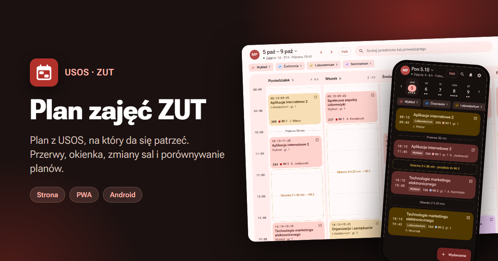
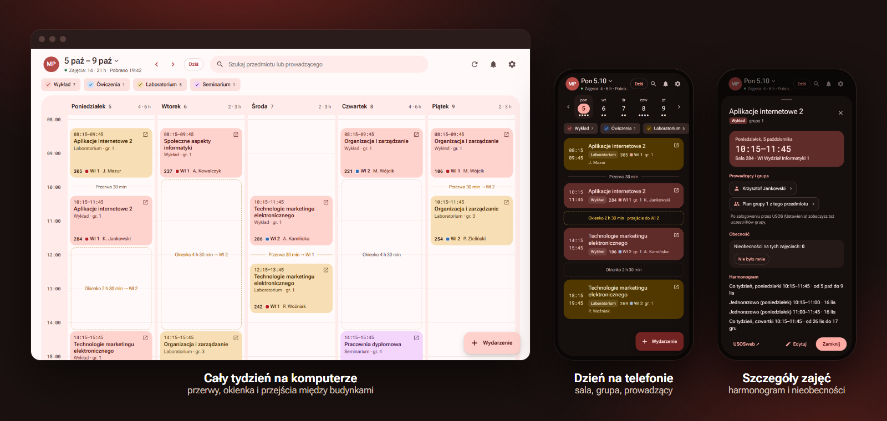

# Plan zajęć ZUT



Przeglądarka planu zajęć z USOS ZUT. USOSweb na telefonie jest niewygodny, a ZUT-u nie ma w oficjalnej aplikacji USOS, więc powstało to.

Wszystko działa w przeglądarce: plany, ustawienia i logowanie są trzymane w `localStorage` na urządzeniu użytkownika. Nie ma własnego backendu ani bazy danych. Aplikacja łączy się z USOS API, pobiera czcionki z Google Fonts i, jeśli ktoś je włączy, wysyła anonimowe statystyki wejść do Umami.



## Co potrafi

**Plan**
- plan z linku do kalendarza USOSweb (iCal), z pliku `.ics` albo z konta USOS (OAuth, cały semestr)
- widok tygodnia na komputerze i dnia na telefonie, z przerwami, okienkami i przejściami między budynkami
- kilka planów naraz i porównywanie dwóch planów ze wspólnymi okienkami
- filtry typów zajęć (np. bez wykładów)
- skok do dowolnej daty po kliknięciu daty w górnym pasku, strzałki ← → i przycisk „Dziś”

**Zajęcia**
- ręczne zmiany zajęć (sala, godzina, odwołanie) i własne wydarzenia
- detektor kolizji
- licznik nieobecności, osobno dla każdych zajęć
- zmiany wykrywane między pobraniami planu i historia wersji

**Wyszukiwarka**
- podgląd planu przedmiotu (z wyborem grupy) albo prowadzącego, bez zapisywania
- wyniki pogrupowane po wydziałach, z oznaczeniem studiów stacjonarnych i niestacjonarnych

**Urządzenia**
- przenoszenie wybranych planów, nieobecności i ustawień zaszyfrowanym kodem QR, ze skanerem w aplikacji; logowanie USOS dołącza się tylko na życzenie
- link iCal do własnego planu dla zalogowanych kontem USOS, do dodania w kalendarzu telefonu lub komputera
- PWA: da się zainstalować na telefonie i działa offline na ostatnio pobranym planie
- aplikacja na Androida (ten sam kod, opakowany w Capacitor)
- na telefonie pociągnięcie w dół odświeża plan, a przesunięcie palcem zmienia dzień i tydzień

**Reszta**
- ekran powitalny i samouczek przy pierwszym uruchomieniu (da się go włączyć ponownie w Ustawieniach)
- motywy i kolory, zakres godzin siatki

Zbudowane na Svelte 5, Vite i TypeScript.

## Uruchomienie

Wymagany Node.js 22.12 lub nowszy.

```bash
npm install
npm run dev
```

| Polecenie | Co robi |
| --- | --- |
| `npm run dev` | serwer deweloperski |
| `npm run build` | statyczny build do `dist/` |
| `npm run preview` | podgląd builda |
| `npm run check` | sprawdzenie typów (svelte-check) |

Ustawienia builda są w pliku `.env`:

| Zmienna | Co robi |
| --- | --- |
| `VITE_GITHUB_URL` | link do repozytorium (`https://github.com/login/repo`), przycisk na ekranie powitalnym i adres, z którego apka bierze nowe wersje |
| `VITE_SITE_URL` | adres strony, np. `https://plan.example.com`; z niego powstają znaczniki Open Graph z banerem `og.png` (podgląd linku na Messengerze, Discordzie itd.) |
| `VITE_UMAMI_URL` | adres skryptu Umami, np. `https://stats.example.com/script.js` |
| `VITE_UMAMI_ID` | ID strony w Umami |
| `APP_ID` | identyfikator aplikacji na telefon, po publikacji w sklepie nie da się go zmienić |
| `APP_NAME` | nazwa aplikacji pod ikoną |
| `APP_VERSION` | wersja widoczna w sklepie, np. `1.0.0` |
| `APP_BUILD` | numer builda, przy każdej wrzutce do sklepu musi być większy |

Statystyki Umami włączają się tylko wtedy, gdy ustawione są obie zmienne, i tylko w buildzie na stronę (nie w `npm run dev` i nie w aplikacji na telefon). Skrypt nie zbiera części adresu po `?` i `#`, więc nie trafiają tam dane logowania USOS ani kody przenoszenia.

## Docker

Obraz buduje aplikację i serwuje ją przez nginx.

```bash
docker compose up -d --build
```

Aplikacja będzie pod `http://localhost:8080`. Kontener słucha tylko na `127.0.0.1`, na zewnątrz wystawia się go przez reverse proxy. Port zmienisz w `compose.yaml`. Bez Compose:

```bash
docker build -t plan-zut .
docker run -d -p 127.0.0.1:8080:80 --name plan-zut plan-zut
```

Kontener nie przechowuje żadnych danych, więc nie potrzebuje wolumenów.

Na małym VPS-ie sam build potrafi przytkać serwer. Wtedy lepiej zbudować obraz u siebie i go przesłać:

```bash
docker save plan-zut | ssh uzytkownik@serwer docker load
```

### Reverse proxy

Przed kontenerem musi stać serwer z HTTPS. Logowanie przez USOS, szyfrowanie kodu QR, kamera i instalacja PWA wymagają bezpiecznego połączenia poza `localhost`. Minimalny blok dla nginx:

```nginx
location / {
    proxy_pass http://127.0.0.1:8080;
    proxy_set_header Host $host;
    proxy_set_header X-Forwarded-Proto $scheme;
}
```

Nagłówki bezpieczeństwa (CSP, `X-Frame-Options`, `Permissions-Policy` itd.) ustawia już nginx w kontenerze, w `docker/security-headers.conf`. Nie trzeba ich powtarzać na proxy. Domena Umami z `.env` jest dopisywana do CSP przy budowaniu obrazu. Bez Dockera trzeba w tym pliku samemu podmienić `__UMAMI__` na adres Umami albo je usunąć.

## Wdrożenie bez Dockera

`npm run build` tworzy statyczne pliki w `dist/`. Wystarczy je wystawić dowolnym serwerem, np. nginx (przykładowa konfiguracja jest w `docker/nginx.conf`). Ścieżki w buildzie są względne, więc aplikacja działa też w podkatalogu.

## Android

Aplikacja na Androida to ten sam build opakowany w Capacitor. Potrzebne jest Android Studio (ma w sobie JDK i SDK).

```bash
npm run build:native
npm run android
```

Pierwsze polecenie buduje aplikację bez service workera i kopiuje ją do `android/`, drugie otwiera projekt w Android Studio. Stamtąd uruchamia się ją na telefonie albo emulatorze, a plik do Sklepu Play robi się przez Build > Generate Signed App Bundle.

Czym apka różni się od strony:

- logowanie kontem USOS idzie przez kod PIN, bo USOS nie ma jak wrócić do aplikacji
- przycisk wstecz zamyka otwarte okno, a na głównym ekranie minimalizuje aplikację
- dane są osobne niż w przeglądarce, plany przenosi się kodem QR

APK da się też zbudować z konsoli, bez otwierania Android Studio:

```bash
cd android
./gradlew assembleRelease
```

Plik ląduje w `android/app/build/outputs/apk/release/`. Gradle w tym projekcie potrzebuje Javy 21. Jeśli build kończy się błędem „Unsupported class file major version”, ustaw `JAVA_HOME` na JDK 21.

Bez własnego klucza build jest podpisany kluczem debugowym, co wystarcza do instalacji na swoim telefonie. Do Sklepu Play potrzebny jest plik `android/keystore.properties` z polami `storeFile`, `storePassword`, `keyAlias` i `keyPassword`. Ten plik i sam klucz są w `.gitignore`.

Serwer USOS ZUT ma certyfikat od HARICA, którego starsze Androidy nie znają, dlatego jego certyfikat główny jest dołączony do aplikacji (`android/app/src/main/res/raw/`).

### Wydania na GitHubie

Po wypchnięciu taga `v1.2.3` workflow `.github/workflows/android.yml` buduje podpisany APK i dodaje go do wydania jako `plan-zut.apk`. Wersja apki bierze się z taga. Link `releases/latest/download/plan-zut.apk` zawsze wskazuje najnowsze wydanie, więc strona pokazuje go użytkownikom Androida na ekranie powitalnym i w Ustawieniach.

```bash
git tag v1.0.0
git push origin v1.0.0
```

Workflow potrzebuje stałego klucza do podpisu, bo Android nie zaktualizuje apki podpisanej innym kluczem niż poprzednia. Klucz tworzy się raz:

```bash
keytool -genkeypair -v -keystore release.jks -keyalg RSA -keysize 2048 -validity 10000 -alias planzut
```

W ustawieniach repo (Settings > Secrets and variables > Actions) trzeba dodać cztery sekrety: `ANDROID_KEYSTORE` (plik `release.jks` zakodowany przez `base64 -w0 release.jks`), `ANDROID_KEYSTORE_PASSWORD`, `ANDROID_KEY_ALIAS` i `ANDROID_KEY_PASSWORD`. Plik klucza i hasła trzeba trzymać w bezpiecznym miejscu. Po ich utracie nie da się wydać aktualizacji.

Apka raz na dobę pyta GitHuba o najnowsze wydanie. Gdy jest nowsze niż zainstalowane, pokazuje powiadomienie i przycisk pobierania w Ustawieniach. Aktualizację instaluje się na wierzch, dane zostają.

Identyfikator, nazwa i wersja aplikacji biorą się z `.env`. Ikony i ekran startowy generuje się z `assets/logo.png` poleceniem `npx @capacitor/assets generate --android`.

## Klucz API USOS

Podstawowe funkcje działają bez klucza. Logowanie kontem USOS i wyszukiwanie prowadzących po nazwisku wymagają własnego klucza API (`usosapi.zut.edu.pl/developers`), który każdy użytkownik wpisuje u siebie w Ustawieniach. W repozytorium nie ma żadnych kluczy.

Klucz i sekret warto sobie zapisać. USOS nie pokazuje ich drugi raz, a są potrzebne, żeby później anulować klucz.

## USOS i liczba zapytań

Aplikacja stara się nie męczyć USOS-a:

- plan z linku odświeża się sam najwyżej co 10 minut, plan z konta co 6 godzin
- ręczne odświeżanie działa nie częściej niż co 30 sekund
- wyszukiwarka czeka 1,2 s po ostatnim znaku (albo na Enter) i pamięta już pobrane wyniki
- zapytania o grupy idą najwyżej po 3 naraz
- po odpowiedzi 429 nie ma ponawiania

## Struktura

```
src/
  main.ts, App.svelte
  styles/            style globalne, podzielone tematycznie (kolejność w index.css ma znaczenie)
  components/        pasek górny, pasek dni, filtry, siatka tygodnia, lista dnia, wyszukiwarka,
                     samouczek, skaner QR, pull to refresh
    sheets/          okna: powitanie, plany, edycja, szczegóły zajęć, zmiany, nieobecności,
                     konto, ustawienia, eksport i import
  lib/
    dates.ts, ics.ts, events.ts, changes.ts, absences.ts, pattern.ts, view.ts   czysta logika
    types.ts, constants.ts, icons.ts
    storage.ts, planStore.ts      dane w localStorage
    net.ts, transfer.ts           pobieranie, eksport/import danych (szyfrowanie, QR)
    platform.ts                   rzeczy zależne od środowiska (adres powrotu OAuth, iOS itp.)
    usos/                         USOS API: podpis OAuth, logowanie, plany, wyszukiwanie
    app.svelte.ts                 stan aplikacji i wyliczany widok tygodnia
    plans.ts                      operacje na planach (pobieranie, porównanie, podgląd, konto)
    settings.svelte.ts, ui.svelte.ts, tour.ts
public/              ikony PWA
android/             projekt Androida (Capacitor)
assets/              logo, z którego powstają ikony aplikacji
docker/              nginx.conf i security-headers.conf dla kontenera
docs/                grafiki do README
.github/workflows/   CI (check, build) i budowanie APK do wydań
```

## Licencja

MIT, szczegóły w pliku `LICENSE`.
